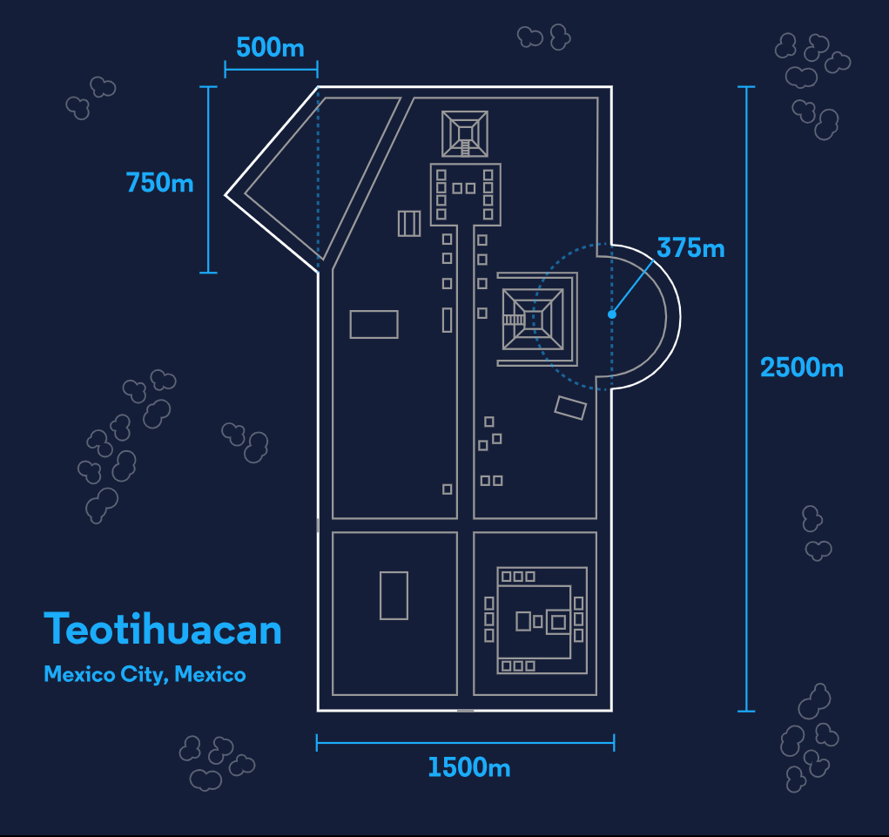
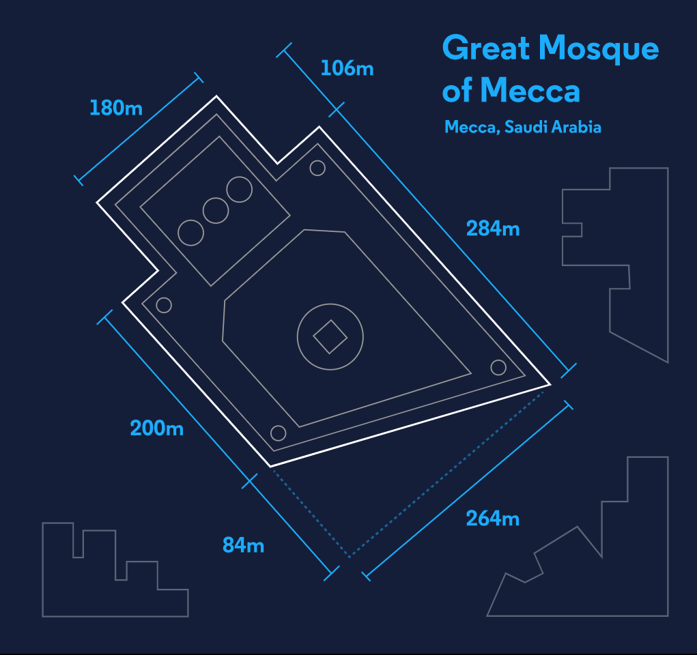
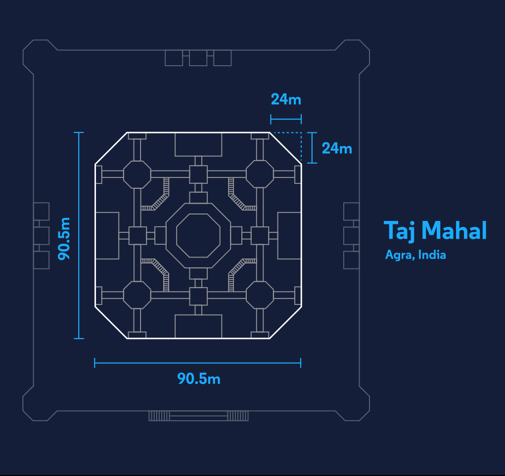

# Architectural Structure Area Calculator
This C# program calculates and displays the areas of three iconic architectural structures: Teotihuacan, the Mosque of Mecca, and the Taj Mahal. Each structure's area is computed by combining the areas of various geometric shapes, such as triangles, circles, and rectangles.

## How to Use
Clone or download the repository containing the code.

Open the solution or project in your preferred C# development environment.

Run the program to see the calculated areas of the architectural structures.

## Code Structure
The program is organized into classes, each representing a specific architectural structure and containing methods for calculating area components.

Teotihuacan Class: Calculates the area of Teotihuacan using methods for triangles, circles, and rectangles.

MosqueOfMecca Class: Computes the area of the Mosque of Mecca, considering triangles and rectangles.

TajMahal Class: Calculates the area of the Taj Mahal by combining triangles and squares.

Program Class: Contains the main method to run the program. It calculates the areas of the three structures and prints the results.

## Contributing
Feel free to contribute enhancements, bug fixes, or other improvements to this code. Submit a pull request to share your changes.

#### Thanks for stoping by, Happy Coding.

